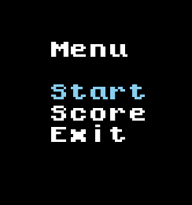
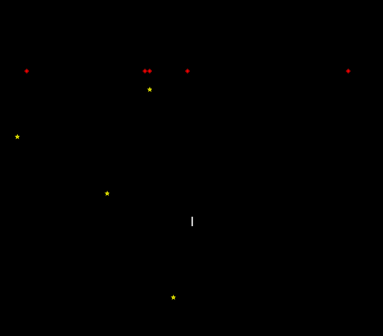
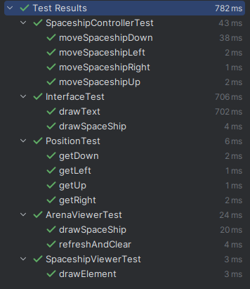
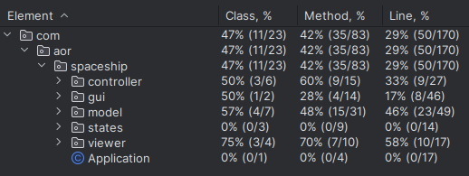

## LDTS_<03><07> - <Space_Shooter>

In this game it will be possible to control a spaceship in order to avoid objects that can cause damage to the ship, namely meteors and eliminate enemy ships, each with a certain amount of life and attack damage of its own. To combat them, our ship will be able to obtain certain power-ups over the course of the game, which can range from a temporary (or permanent) increase in attack damage, number of weapons and life, and increased movement speed.
The objective of the game is to get the highest score possible by destroying enemy ships with the help of power-ups, ending when our ship's health reaches zero.
This project was developed by Miguel Guerrinha (up202205038@fe.up.pt), Rui Cruz (up202208011@fe.up.pt) and Sheila Albino (up202109258@fe.up.pt).

### IMPLEMENTED FEATURES

- **Spaceship moves** - The spaceship moves to the left, right, up and down using the respectively arrows.
- **Meteors falling** - During the game, we have some meteors falling down the screen.
- **Hit by a meteor** - If the spaceship has a collision with a meteor the game stops. 
- **Spawn and catch power-ups** - When the game starts, a certain number of power-ups appear in the screen and we are able to catch them with our spaceship.

### PLANNED FEATURES

- **Implement a menu** - The game will have the initial menu.
- **Enemies spaceships** - The game will have some enemies that are other spaceships.
- **Shots from enemies spaceships** - The enemies spaceships will have guns capable to fire projectile.
- **Enemies projectiles can kill our spaceship** - If a projectile from an enemy spaceship hit our spaceship we lost.
- **Spawning power-ups** - If we kill a special enemy spaceship it will drop a power-up that will fall down and if we can catch it, it will upgrade our spaceship.
- **Shots from our spaceship** - Our spaceship have guns capable to fire projectiles able to destroy enemies spaceships.
- **Health of spaceships** - Every spaceship have a certain quantity of health and when that health is zero the spaceship is destroyed.
- **Power of shots** - During the game by catching power-ups the projectiles from our spaceship will have more power.
- **Score** - Every time we hit an enemy spaceship our score increase.

### SCREENSHOTS

- **Menu Preview** - Temporary menu that will still undergo several design and implementation changes. So far it's possible to start and exit the game.

  

- **Arena Preview** - Like the menu, this arena is the basis of what we intend to implement in the future, the appearance of the elements will be changed, improving the visual aspect of the game and some missing elements will be added later, namely enemy spaceships.

  

### DESIGN

> This section should be organized in different subsections, each describing a different design problem that you had to solve during the project. Each subsection should be organized in four different parts:

- **Problem in Context.** The description of the design context and the concrete problem that motivated the instantiation of the pattern. Someone else other than the original developer should be able to read and understand all the motivations for the decisions made. When refering to the implementation before the pattern was applied, don’t forget to [link to the relevant lines of code](https://help.github.com/en/articles/creating-a-permanent-link-to-a-code-snippet) in the appropriate version.
- **The Pattern.** Identify the design pattern to be applied, why it was selected and how it is a good fit considering the existing design context and the problem at hand.
- **Implementation.** Show how the pattern roles, operations and associations were mapped to the concrete design classes. Illustrate it with a UML class diagram, and refer to the corresponding source code with links to the relevant lines (these should be [relative links](https://help.github.com/en/articles/about-readmes#relative-links-and-image-paths-in-readme-files). When doing this, always point to the latest version of the code.
- **Consequences.** Benefits and liabilities of the design after the pattern instantiation, eventually comparing these consequences with those of alternative solutions.

**Example of one of such subsections**:

------

#### THE JUMP ACTION OF THE KANGAROOBOY SHOULD BEHAVE DIFFERENTLY DEPENDING ON ITS STATE

**Problem in Context**

There was a lot of scattered conditional logic when deciding how the KangarooBoy should behave when jumping, as the jumps should be different depending on the items that came to his possession during the game (an helix will alow him to fly, driking a potion will allow him to jump double the height, etc.). This is a violation of the **Single Responsability Principle**. We could concentrate all the conditional logic in the same method to circumscribe the issue to that one method but the **Single Responsability Principle** would still be violated.

**The Pattern**

We have applied the **State** pattern. This pattern allows you to represent different states with different subclasses. We can switch to a different state of the application by switching to another implementation (i.e., another subclass). This pattern allowed to address the identified problems because […].

**Implementation**

The following figure shows how the pattern’s roles were mapped to the application classes.

These classes can be found in the following files:

- [Character](https://web.fe.up.pt/~arestivo/page/courses/2021/lpoo/template/src/main/java/Character.java)
- [JumpAbilityState](https://web.fe.up.pt/~arestivo/page/courses/2021/lpoo/template/src/main/java/JumpAbilityState.java)
- [DoubleJumpState](https://web.fe.up.pt/~arestivo/page/courses/2021/lpoo/template/src/main/java/DoubleJumpState.java)
- [HelicopterState](https://web.fe.up.pt/~arestivo/page/courses/2021/lpoo/template/src/main/java/HelicopterState.java)
- [IncreasedGravityState](https://web.fe.up.pt/~arestivo/page/courses/2021/lpoo/template/src/main/java/IncreasedGravityState.java)

**Consequences**

The use of the State Pattern in the current design allows the following benefits:

- The several states that represent the character’s hability to jump become explicit in the code, instead of relying on a series of flags.
- We don’t need to have a long set of conditional if or switch statements associated with the various states; instead, polimorphism is used to activate the right behavior.
- There are now more classes and instances to manage, but still in a reasonable number.

#### State 

**Problem in Context**

In the game, different states need to be managed, such as Running, Paused, and GameOver. Each state has specific key processing logic and on-screen drawings.

**The Pattern**

We have applied the ***State*** pattern. This pattern helps you in State Management, i.e. encapsulating the specific behavior of each game state in separate classes (RunningState, PausedState, GameOverState). and Extension facility that allows the addition of new states without modifying existing classes.

**Implementation**

Create a GameState or State interface with processKey() and draw() methods to represent the behaviors common to all states.
Implement classes (RunningState, PausedState, GameOverState) that inherit or implement the GameState interface with state-specific logic.

**Consequences**

-Maintainability: Ease of adding, removing, or modifying states.
-Readability: Clarity in separating the logic of each game state.

#### Factory

**Problem in Context**

The creation of game elements (Meteor, Power, SpaceShip) needs to be flexible and extensible to add new types of elements in the future.

**The Pattern**

Flexible Object Creation: Allow the creation of objects without specifying the exact class of the object to be created.
Encapsulate Creation: Delegate creation responsibility to subclasses.

**Implementation**

Create a common Element interface or abstract class for all game elements.
Implement an ElementFactory class with methods (e.g., createMeteor(), createPower(), createSpaceShip()) to create each element type.
ElementFactory subclasses for each element type that implement the authoring methods.

**Consequences**

-Flexibility: Makes it easy to add new types of elements.
-Decoupling: Separates the object's creation logic from its specific implementations.

#### MVC Pattern

**Problem in Context**

It is necessary to separate the responsibilities of business, GUI, and game control to facilitate the maintenance and reuse of the code.

**The Pattern**

Separation of Responsibilities: Divide the application into Model (business logic), View (graphical interface) and Controller (control of user interactions).
Maintainability: Allow changes to one layer without affecting the others.

**Implementation**

Model: Refatorar as classes existentes para representar a lógica de negócios do jogo (como Arena, Element, Game).
View: Classes relacionadas à interface gráfica (TextGraphics, métodos de desenho na tela).
Controller: Gerenciar a interação do usuário (Arena.processKey(), métodos de controle de entrada).

**Consequences**

-Organização Estruturada: Divisão clara das responsabilidades do sistema.
-Facilidade de Manutenção: Alterações em uma camada não afetam diretamente as outras.

#### KNOWN CODE SMELLS

> This section should describe 3 to 5 different code smells that you have identified in your current implementation.

### TESTING
We were able to successfully carry out 4 tests:

- The **CollisionTest**, which checks if the game ends when a meteor collides with our ship.
- The **MeteorTest** which allows us to test if the meteor always moves on the y-axis and downwards.
- The **PowerTest** which checks if, after the ship collects a power-up, it disappears from the available list of power-ups.
- The **SpaceShipTest**, which tests the movement of our spaceship because if it doesn't work properly, we won't be able to defeat the enemies that will appear in the future.

  

- **Screenshot of coverage report**
        - class coverage: 66%, method coverage: 73%, line coverage 50%

  

### SELF-EVALUATION

> In this section describe how the work regarding the project was divided between the students. In the event that members of the group do not agree on a work distribution, the group should send an email to the teacher explaining the disagreement.

**Example**:

- John Doe: 40%
- Jane Doe: 60%
