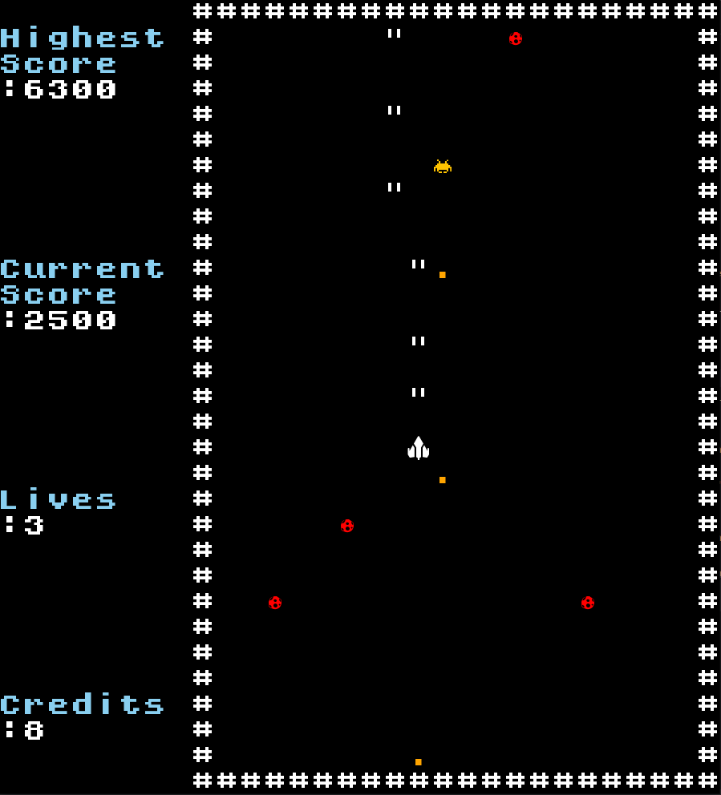
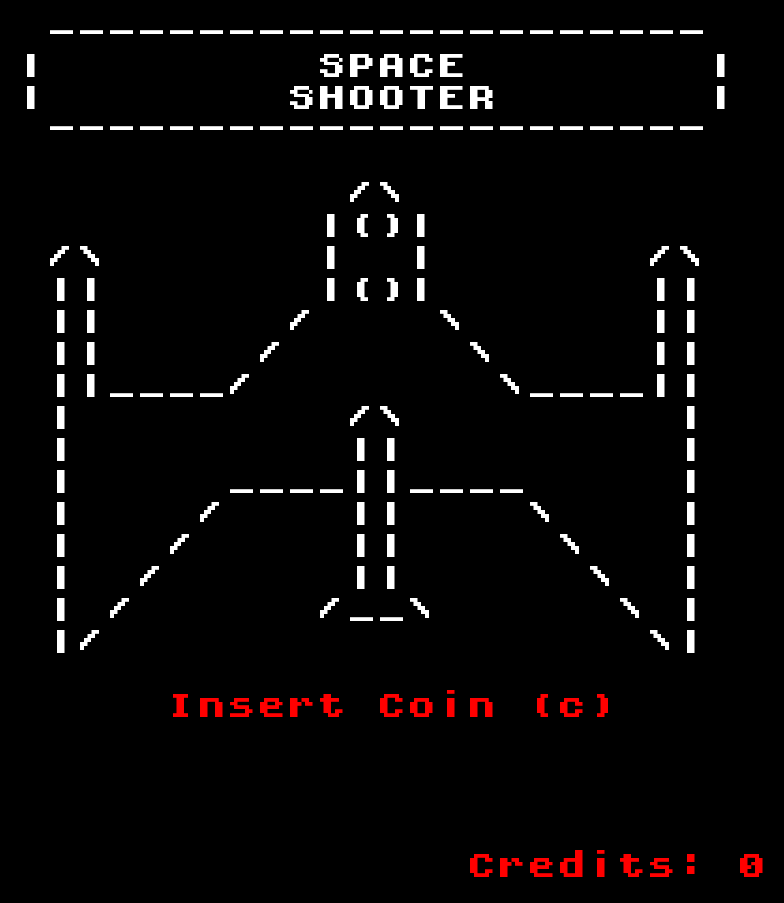
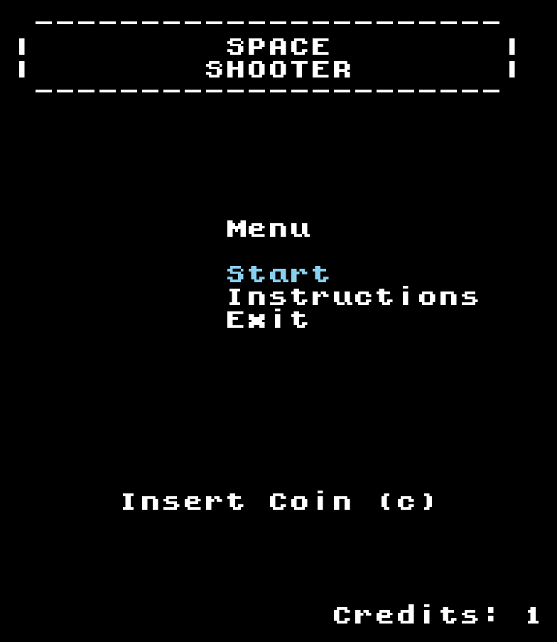
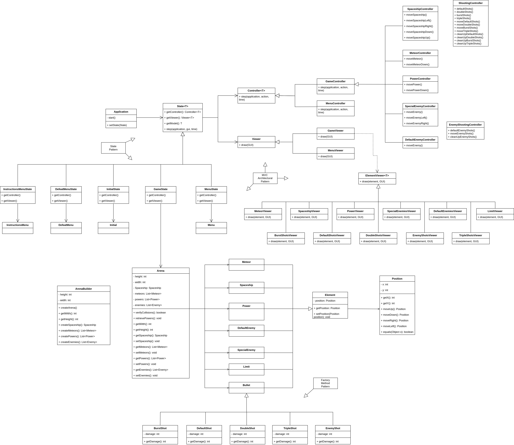
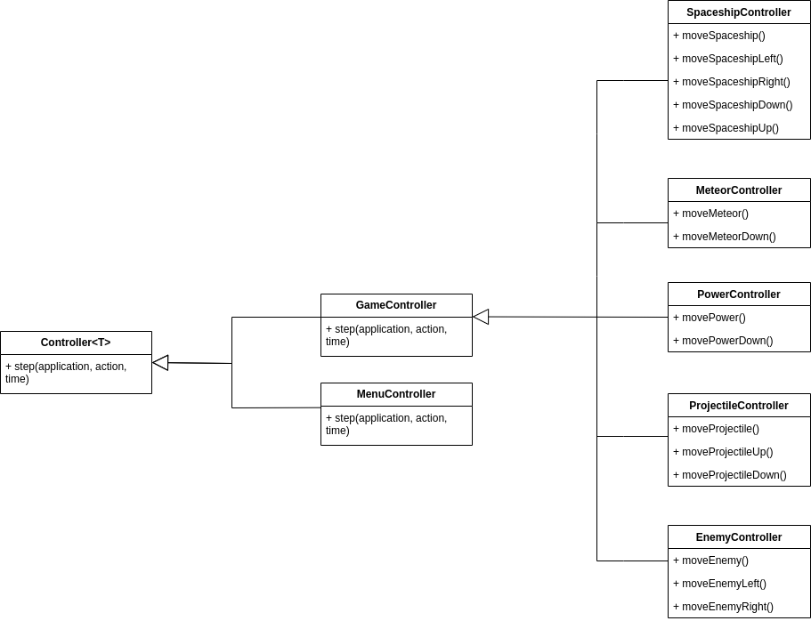
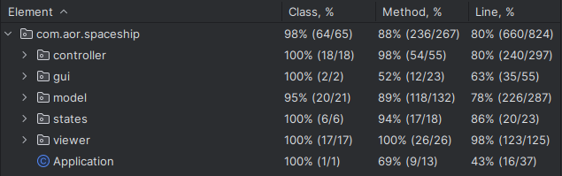

## LDTS_0307 - Space Shooter

In this game it will be possible to control a spaceship in order to avoid objects that can cause damage to the ship, namely meteors and eliminate enemy ships, each with a certain amount of life and attack damage of its own. To combat them, our ship will be able to obtain certain power-ups over the course of the game, which can range from a temporary (or permanent) increase in attack damage, number of weapons and life, and increased movement speed.
The objective of the game is to get the highest score possible by destroying enemy ships with the help of power-ups, ending when our ship's health reaches zero.
This project was developed by Miguel Guerrinha (up202205038@fe.up.pt), Rui Cruz (up202208011@fe.up.pt) and Sheila Albino (up202109258@fe.up.pt).

## IMPLEMENTED FEATURES

- **Implement a menu** - The game have an initial menu.
- **Interactive menu** - The menu is interactive, and we can navigate it using the up and down arrows.
- **Insert coin** - It's necessary to increase the number of credits by "inserting a coin", to be possible to play the game. Everytime we play we lose a coin.
- **Spaceship moves** - The spaceship moves to the left, right, up and down using the respectively arrows.
- **Spawn and catch power-ups** - When the game starts, a certain number of power-ups appear in the screen and, we are able to catch them with our spaceship.
- **Meteors falling** - During the game, we have some meteors falling down the screen.
- **Hit by a meteor** - If the spaceship has a collision with a meteor the game stops.
- **Shots from our spaceship** - Our spaceship have guns capable to fire projectiles able to destroy enemies spaceships.
- **Health of spaceships** - Every spaceship have a certain quantity of health and when that health is zero the spaceship is destroyed.
- **Enemies spaceships** - The game have some enemies that are other spaceships.
- **Shots from enemies spaceships** - The enemies spaceships have guns capable to fire projectile.
- **Enemies projectiles can kill our spaceship** - If a projectile from an enemy spaceship hit our spaceship we lost energy.
- **Spawning power-ups** - If we kill a special enemy spaceship it will drop a power-up that will fall down and if we can catch it, it will upgrade our spaceship.
- **Power of shots** - During the game by catching power-ups the projectiles from our spaceship will have more power.
- **Score** - Every time we hit an enemy spaceship our score increase.

## PLANNED FEATURES

- **Implement Sounds** - the game will have sound effects.

## SCREENSHOTS

The following screenshots and gifs represent the structure of our game and how it looks visually.

## Game

  

Killing a special enemy and winning a random power.

  

In this case, we won a doubleshot for a short period of time.

  

## Menus

- **Initial Menu Preview** - Just like retro arcade machines, you have to insert a credit to start the game.

  

- **Main Menu Preview**

  

- **Instructions Menu Preview** - Where you can learn all about our game, from the way the spaceship moves to the characters used.

  

- **Lose Menu Preview** - When you die, you have the option of continuing in the game if there are credits for it or leaving.

  

## DESIGN

### Structure

#### Problem in Context
The problem lies in the lack of a clear and well-defined structure to separate the game's business logic, visual presentation, and interaction control. This results in complexity, maintenance difficulties, low code reusability, and potential conflicts among different parts of the game. The **MVC Pattern** is a solution that addresses these challenges by dividing the game into three distinct components (Model, View, and Controller) to provide an organized and modular structure.

#### The Pattern
This pattern allows for a clear separation of concerns, making it easier to maintain code, scale the application, and reuse components. In addition, it facilitates collaboration between development teams, as each component has a clearly defined responsibility.

#### Implementation
For MVC Pattern implementation, the **Model**: Refactors existing classes to represent the game's business logic (such as Arena, Element, Game),
**View**: These are the Classes related to the graphical interface (TextGraphics, on-screen drawing methods).
and **Controller**: Manages user interaction (Arena.processKey(), input control methods).

  

#### Consequences
- **Structured Organization**: Clear division of system responsibilities.
- **Ease of Maintenance**: Changes to one layer do not directly affect the others.

### State Pattern

#### Problem in Context

In the game, different states need to be managed, such as Running, Paused, and GameOver. Each state has specific key processing logic and on-screen drawings.

#### The Pattern

We have applied the ***State*** pattern. This pattern helps you in State Management, i.e. encapsulating the specific behavior of each game state in separate classes (RunningState, PausedState, GameOverState). and Extension facility that allows the addition of new states without modifying existing classes.

#### Implementation

Regarding implementation, the State Pattern creates a GameState or State interface with processKey() and draw() methods to represent behaviors common to all states and also implements classes (RunningState, PausedState, GameOverState) that inherit or implement the GameState interface with specific logic of each state.

  

#### Consequences

The use of the State Pattern in the current design allows the following benefits:
- **Maintainability**: Ease of adding, removing, or modifying states.
- **Readability**: Clarity in separating the logic of each game state.

### Factory Pattern

#### Problem in Context
In our game we have a few types of bullets. This turned out to be a problem related to the creation of diverse objects with varying configurations and functionalities. As the project evolved, new requirements emerged, necessitating the dynamic instantiation of different types of objects

#### The Pattern

To address this issue, we adopted the **Factory Pattern**. This design pattern provides a structured and modular solution to object creation by introducing a Creator interface or abstract class with a factory method.

#### Implementation

As for the implementation, the factory creates a common controller interface or an abstract class for the Bullet

  

#### Consequences

- **Flexibility**: Makes it easy to add new types of elements.
- **Decoupling**: Separates the object's creation logic from its specific implementations.

## KNOWN CODE SMELLS
// To Do!

## TESTING
- **Screenshot of coverage report** - class coverage: 98%, method coverage: 88%, line coverage 80%

  

### Mutation Tests - PIT

  

## SELF-EVALUATION

- Miguel Guerrinha: 45%
- Rui Cruz: 45%
- Sheila Albino: 10%
  
