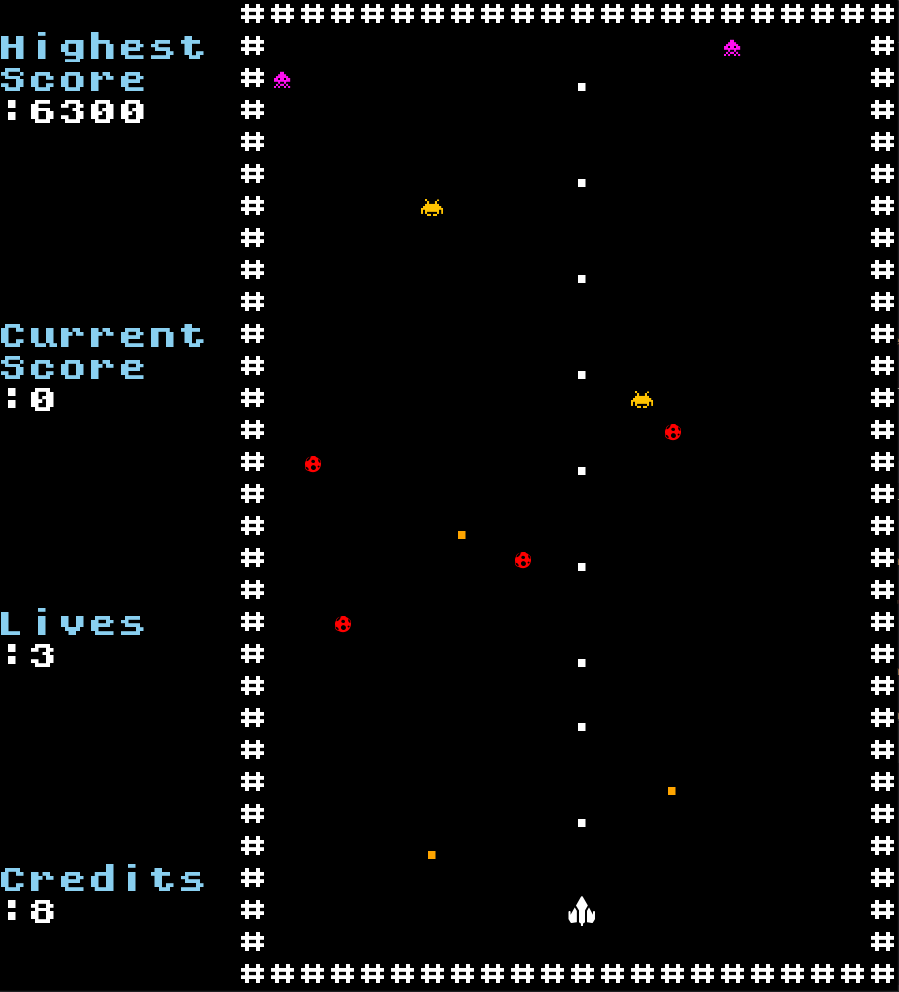
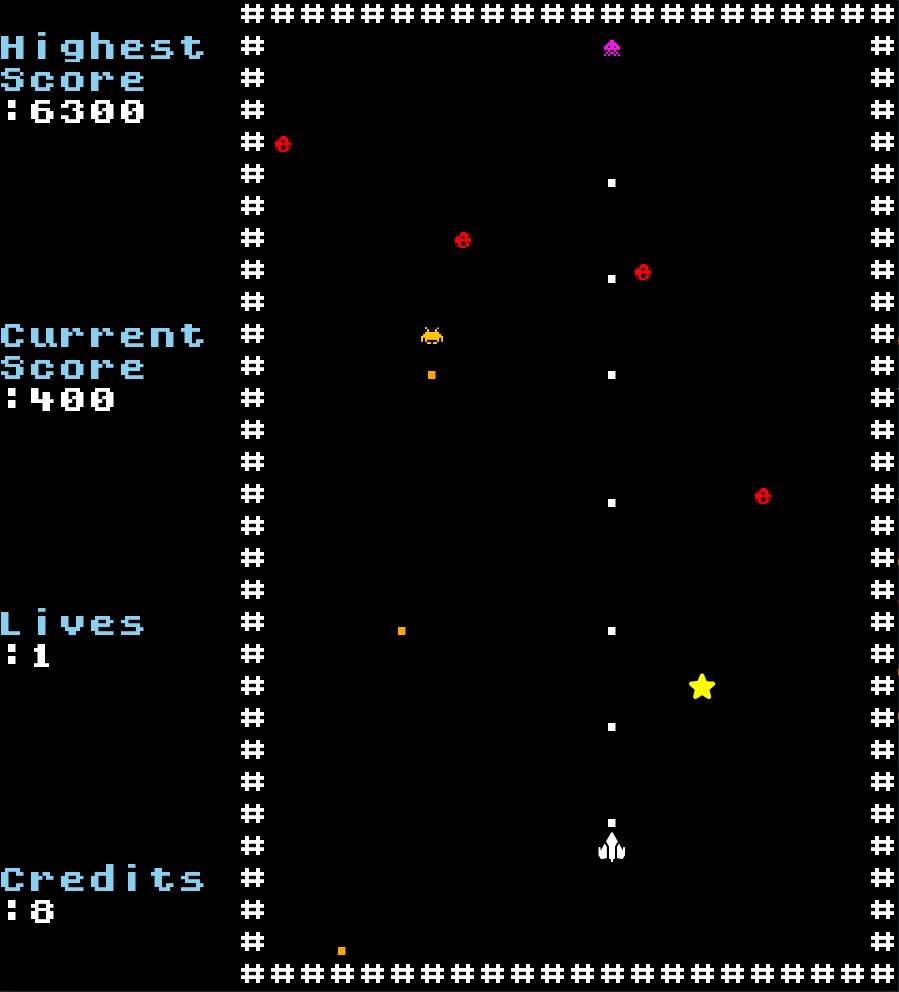
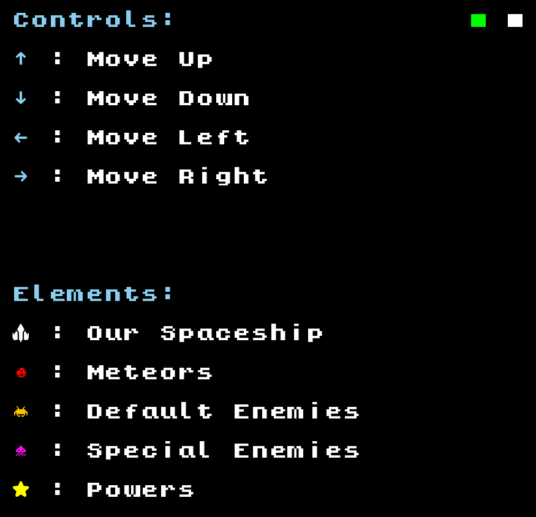
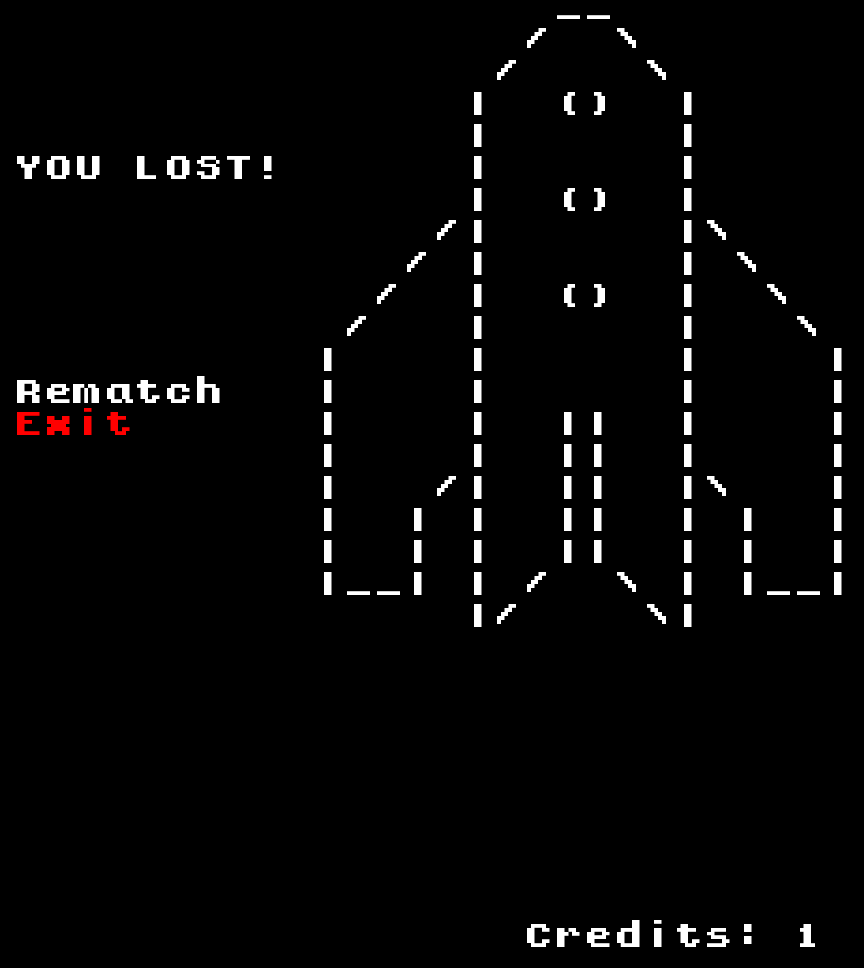

## LDTS_0307 - Space Shooter

In this game it will be possible to control a spaceship in order to avoid objects that can cause damage to the ship, namely meteors and eliminate enemy ships, each with a certain amount of life and attack damage of its own. To combat them, our ship will be able to obtain certain power-ups over the course of the game, which can range from a temporary (or permanent) increase in attack damage, number of weapons and life, and increased movement speed.
The objective of the game is to get the highest score possible by destroying enemy ships with the help of power-ups, ending when our ship's health reaches zero.

This project was developed by Miguel Guerrinha (up202205038@fe.up.pt), Rui Cruz (up202208011@fe.up.pt) and Sheila Albino (up202109258@fe.up.pt).

For a more detailed version of this description click [**here**](./docs/README.md).

## SCREENSHOTS

The following screenshots represent the structure of our game and how it looks visually.

### Game

  

    <b><i>Fig.1 Game Overview</i></b>

 
 

  

    <b><i>Fig.2 Killing a special enemy and a random power falling</i></b>

 
 

  

    <b><i>Fig.3 Catching a random power, in this case, a doubleshot</i></b>

 
 

### Menus

- **Initial Menu Preview** - Just like retro arcade machines, you have to insert a credit to start the game.

  

    <b><i>Fig.4 Initial Menu</i></b>

 
 

- **Main Menu Preview**

  

    <b><i>Fig.5 Main Menu</i></b>

 
 

- **Instructions Menu Preview** - Where you can learn all about our game, from the way the spaceship moves to the characters used.

  

    <b><i>Fig.6 Instructions Menu</i></b>

 
 

- **Lose Menu Preview** - When you die, you have the option of continuing in the game if there are credits for it or leaving.

  

    <b><i>Fig.7 Lose Menu</i></b>

 
 