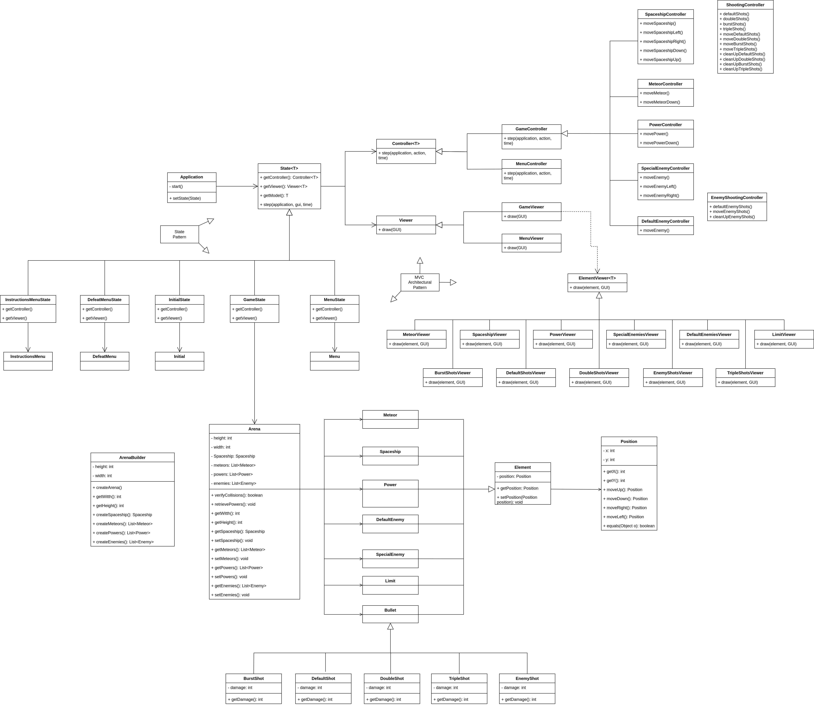
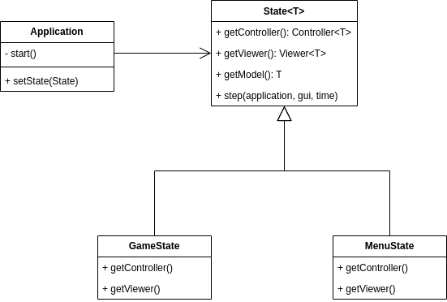
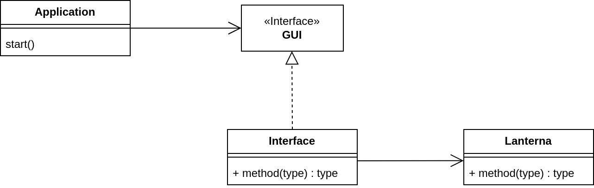
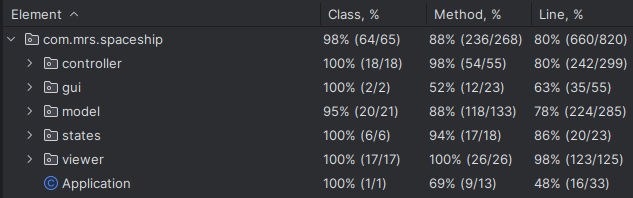
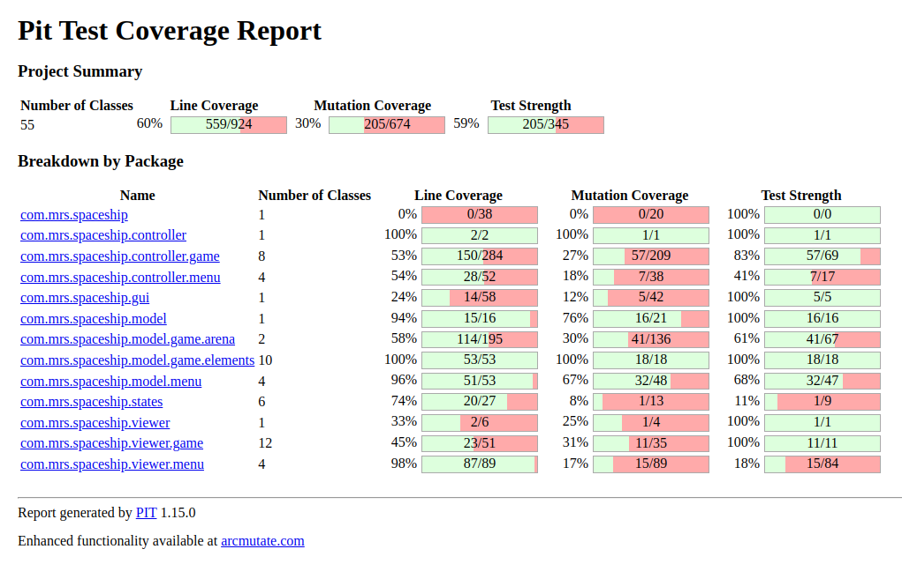

## LDTS_0307 - Space Shooter

In this game it will be possible to control a spaceship in order to avoid objects that can cause damage to the ship, namely meteors and eliminate enemy ships, each with a certain amount of life and attack damage of its own. To combat them, our ship will be able to obtain certain power-ups over the course of the game, which can range from a temporary (or permanent) increase in attack damage, number of weapons and life, and increased movement speed.
The objective of the game is to get the highest score possible by destroying enemy ships with the help of power-ups, ending when our ship's health reaches zero.

This project was developed by Miguel Guerrinha (up202205038@fe.up.pt), Rui Cruz (up202208011@fe.up.pt) and Sheila Albino (up202109258@fe.up.pt).

## IMPLEMENTED FEATURES

- **Implement a menu** - The game have an initial menu.
- **Interactive menu** - The menu is interactive, and we can navigate it using the up and down arrows.
- **Insert coin** - It's necessary to increase the number of credits by "inserting a coin", to be possible to play the game. Everytime we play we lose a coin.
- **Spaceship moves** - The spaceship moves to the left, right, up and down using the respectively arrows.
- **Spawn and catch power-ups** - When the game starts, a certain number of power-ups appear in the screen and, we are able to catch them with our spaceship.
- **Meteors falling** - During the game, we have some meteors falling down the screen.
- **Hit by a meteor** - If the spaceship has a collision with a meteor the game stops.
- **Shots from our spaceship** - Our spaceship have guns capable to fire projectiles able to destroy enemies spaceships.
- **Health of spaceships** - Every spaceship have a certain quantity of health and when that health is zero the spaceship is destroyed.
- **Enemies spaceships** - The game have some enemies that are other spaceships.
- **Shots from enemies spaceships** - The enemies spaceships have guns capable to fire projectile.
- **Enemies projectiles can kill our spaceship** - If a projectile from an enemy spaceship hit our spaceship we lost energy.
- **Spawning power-ups** - If we kill a special enemy spaceship it will drop a power-up that will fall down and if we can catch it, it will upgrade our spaceship.
- **Power of shots** - During the game by catching power-ups the projectiles from our spaceship will have more power.
- **Score** - Every time we hit an enemy spaceship our score increase.

## PLANNED FEATURES

- **Implement Sounds** - The integration of sound effects into the game was planned for a more immersive experience. However, this feature has not been implemented yet.

## DESIGN

### Structure

#### Problem in Context
The problem lies in the lack of a clear and well-defined structure to separate the game's business logic, visual presentation, and interaction control. This results in complexity, maintenance difficulties, low code reusability, and potential conflicts among different parts of the game. The **MVC Pattern** is a solution that addresses these challenges by dividing the game into three distinct components (Model, View, and Controller) to provide an organized and modular structure.

#### The Pattern
This pattern offers a distinct separation of concerns, enhancing the maintainability, scalability, and reusability of code. Moreover, it fosters collaboration among development teams by assigning well-defined responsibilities to each component. This clear division of labor makes it easier to manage, update, and extend the application.

#### Implementation
For MVC Pattern implementation, the **Model**: Refactors existing classes to represent the game's business logic (such as Arena, Element, Game),
**View**: These are the classes related to the graphical interface (TextGraphics, on-screen drawing methods).
and **Controller**: Handles user interaction, managing functions like Arena.processKey() and other input control methods. 
This approach ensures a cohesive and organized structure, with each component having well-defined responsibilities.

  

    <b><i>Fig.8 UML using Model, Controller and Viewer pattern design</i></b>

These packages can be found here:
- [**Controller**](https://github.com/FEUP-LDTS-2023/project-l03gr07/tree/main/src/main/java/com/mrs/spaceship/controller)
- [**Model**](https://github.com/FEUP-LDTS-2023/project-l03gr07/tree/main/src/main/java/com/mrs/spaceship/model)
- [**Viewer**](https://github.com/FEUP-LDTS-2023/project-l03gr07/tree/main/src/main/java/com/mrs/spaceship/viewer)

#### Consequences
- **Structured Organization**: Clear division of system responsibilities.
- **Ease of Maintenance**: Changes to one layer do not directly affect the others.
- **Code Reusability**: Components can be reused across different projects or modules, reducing redundant development efforts.
- **Enhanced Testability**: Isolation of components makes it easier to write unit tests, ensuring better code reliability and stability.

### State Pattern

#### Problem in Context

In the game, different states need to be managed, such as Running, Paused, and GameOver. Each state has specific key processing logic and on-screen drawings.

#### The Pattern

We have applied the ***State*** pattern. This pattern helps you in State Management, i.e. encapsulating the specific behavior of each game state in separate classes (GameState, MenuState, DefeatMenuState). and Extension facility that allows the addition of new states without modifying existing classes.

#### Implementation

In terms of implementation, the State Pattern introduces a GameState or State interface with processKey() and draw() methods, representing behaviors common to all states. It also involves the creation of classes (MenuState, DefeatMenuState) that inherit the abstract class ***State***, each incorporating the specific logic of its respective state.

  

    <b><i>Fig.9 State Pattern</i></b>

These classes can be found here:
- [**States**](https://github.com/FEUP-LDTS-2023/project-l03gr07/tree/main/src/main/java/com/mrs/spaceship/states)

#### Consequences

The use of the State Pattern in the current design allows the following benefits:
- **Maintainability**: Ease of adding, removing, or modifying states.
- **Readability**: Clarity in separating the logic of each game state.
- **Simplified Maintenance**: As each state is encapsulated in its own class, modifying or extending a particular state does not affect other states. This simplifies maintenance and reduces the risk of unintended side effects when introducing new features or modifying existing ones.

### Facade Pattern

#### Problem in Context
As the project evolved, the imperative for a versatile and well-organized code structure became evident. Seeking a solution that would facilitate easy modifications and enhance overall organization, we explored various possibilities. 
The concept of implementing an interface emerged as the most promising, offering flexibility and adaptability to accommodate the specific requirements posed by the lanterna library.
This approach proved to be the optimal choice among the alternatives available, contributing to a more robust and maintainable codebase.

#### The Pattern

To address this issue, we adopted the **Facade Pattern**. This design pattern provides a unified interface to a set of interfaces in a subsystem. It also defines a higher-level interface that makes the subsystem easier to use.

#### Implementation

  

    <b><i>Fig.10 Facade Pattern</i></b>

These classes can be found here:
- [**Application**](https://github.com/FEUP-LDTS-2023/project-l03gr07/blob/main/src/main/java/com/mrs/spaceship/Application.java)
- [**GUI**](https://github.com/FEUP-LDTS-2023/project-l03gr07/blob/main/src/main/java/com/mrs/spaceship/gui/GUI.java)
- [**Interface**](https://github.com/FEUP-LDTS-2023/project-l03gr07/blob/main/src/main/java/com/mrs/spaceship/gui/Interface.java)

#### Consequences

- **Simplification of the interface**: It provides a simplified interface to a larger body of code, making it easier to understand and use.
- **Encapsulation of Complexity**: It encapsulates the complex interactions within the subsystem, exposing only what is necessary for the client. This helps in managing and understanding complex systems.
- **Better Organization**: Facade can serve as a point for organizing subsystem components, providing a clear and organized structure to the overall system. 

## KNOWN CODE SMELLS
We were able to resolve practically all the errors reported by error-prone, except for those relating to the [**scheduleSpecialEnemySpawnWithDelay**](https://github.com/FEUP-LDTS-2023/project-l03gr07/blob/main/src/main/java/com/mrs/spaceship/model/game/arena/Arena.java#L190) and [**scheduleDefaultEnemySpawnWithDelay**](https://github.com/FEUP-LDTS-2023/project-l03gr07/blob/main/src/main/java/com/mrs/spaceship/model/game/arena/Arena.java#L218) functions, 
which we assume may be related to the fact that we use threads to time the spawning of the enemies. 

Still on the same class [**Arena**](https://github.com/FEUP-LDTS-2023/project-l03gr07/blob/main/src/main/java/com/mrs/spaceship/model/game/arena/Arena.java), it ended up becoming more extensive compared to the others because we were unable to find an effective way of connecting it to the ArenaBuilder without compromising the rest of the code.
 
 
As for the controllers of the shootings, both the [**spaceship**](https://github.com/FEUP-LDTS-2023/project-l03gr07/blob/main/src/main/java/com/mrs/spaceship/controller/game/ShootingController.java) and the [**enemies**](https://github.com/FEUP-LDTS-2023/project-l03gr07/blob/main/src/main/java/com/mrs/spaceship/controller/game/EnemyShootingController.java), the classes ended up being larger than planned, due to the inefficient way in which we chose to eliminate the shots that collided with a certain element 
(sending them outside the limits of the arena and then using an auxiliary function, using iterators to eliminate them).

## TESTING
- **Screenshot of coverage report** - class coverage: 98%, method coverage: 88%, line coverage 80%

  

    <b><i>Fig.11 Coverage</i></b>

### Mutation Tests - PIT

  

    <b><i>Fig.12 Mutation Tests</i></b>

## SELF-EVALUATION

- Miguel Guerrinha: 45%
- Rui Cruz: 45%
- Sheila Albino: 10%
  
